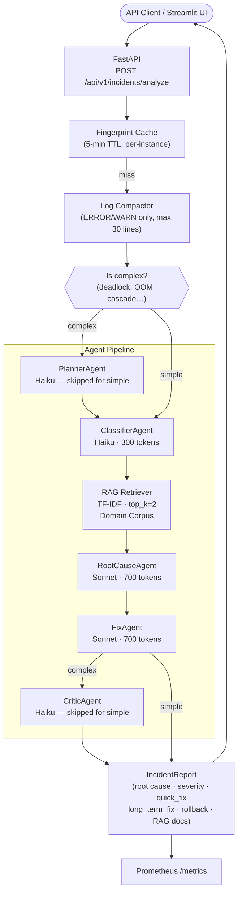

# AI Production Incident Debugger

> A production-grade, multi-agent AI system that automatically diagnoses production incidents. Paste an error, stack trace, and logs — receive a structured report with root cause, severity, immediate fix, long-term prevention, validation steps, rollback plan, and similar past incidents from a RAG knowledge base. All in under 60 seconds, under $0.01.

---

## Problem Statement

On-call engineers face a recurring bottleneck: when a production incident fires at 2 AM, diagnosing root cause and forming a remediation plan can take 30–90 minutes of manual log digging and runbook hunting. This system automates that loop using a coordinated pipeline of specialized AI agents, each focused on a single concern — classification, root cause, fix, and quality review — backed by retrieval-augmented generation from a domain-specific past-incident knowledge base.

---

## Key Features

| Feature | Description |
|---------|-------------|
| **5-agent pipeline** | Planner → Classifier → RootCause → Fix → Critic, each with a focused prompt and Pydantic-validated output |
| **Intelligent routing** | Simple incidents skip Planner and Critic (3 agents, ~$0.004); complex incidents run all 5 (~$0.006) |
| **RAG context** | TF-IDF retriever matches current incident against a domain-specific corpus; top-2 matches are injected as context |
| **Structured fix output** | API returns separate `quick_fix` (30-min on-call action) and `long_term_fix` (preventive change) |
| **Resilience** | Circuit breaker, exponential backoff, per-incident cost ceiling ($0.10), 5-min fingerprint cache |
| **Degraded mode** | Non-blocking agents (Fix, Critic) fall back to safe defaults; pipeline never returns HTTP 500 |
| **Full observability** | structlog structured logging, Prometheus metrics, Grafana dashboard |
| **130+ unit tests** | Evaluation harness with 10 labeled cases; mock LLM builder for deterministic testing |

---

## Architecture



### Agent Responsibilities

| Agent | Model | Role | Blocking? |
|-------|-------|------|-----------|
| **PlannerAgent** | Haiku | Estimates complexity; skipped for simple incidents | No (non-blocking) |
| **ClassifierAgent** | Haiku | Categorizes error type; extracts key signals | Yes (blocks pipeline) |
| **RootCauseAgent** | Sonnet | Identifies exact root cause using signals + RAG context | Yes (blocks pipeline) |
| **FixAgent** | Sonnet | Produces `quick_fix`, `long_term_fix`, validation steps, rollback plan | No (falls back on failure) |
| **CriticAgent** | Haiku | Assigns severity and confidence score; skipped for simple incidents | No (falls back on failure) |

---

## Tech Stack

| Layer | Technology |
|-------|-----------|
| API framework | FastAPI + uvicorn |
| Language | Python 3.11+ |
| LLM provider | Anthropic (claude-haiku-4-5, claude-sonnet-4-6) |
| Agent framework | Custom `BaseAgent` — retry, circuit breaker, cost tracking |
| RAG retrieval | TF-IDF (scikit-learn) — domain-specific incident corpus |
| Data validation | Pydantic v2 |
| Observability | structlog (structured JSON) + Prometheus + Grafana |
| UI | Streamlit + Plotly |
| Testing | pytest + pytest-asyncio (130+ unit tests) |
| Containerisation | Docker + Docker Compose |

---

## How to Run Locally

### 1. Install dependencies

```bash
pip install poetry
poetry install
```

### 2. Configure environment

```bash
cp .env.example .env
# Edit .env and set:
# ANTHROPIC_API_KEY=sk-ant-...
```

### 3. Start the FastAPI backend

```bash
py -m uvicorn apps.api.main:app --reload
```

Backend runs at `http://127.0.0.1:8000`

| Endpoint | Description |
|----------|-------------|
| `POST /api/v1/incidents/analyze` | Analyze an incident |
| `GET /healthz` | Health check |
| `GET /metrics` | Prometheus metrics |
| `GET /docs` | Interactive Swagger UI |

### 4. Start the Streamlit dashboard

In a second terminal:

```bash
py -m streamlit run apps/ui/incident_dashboard.py
```

Dashboard runs at `http://localhost:8501`

### 5. (Optional) Start the full observability stack

```bash
docker compose up api prometheus grafana
```

| Service | URL | Credentials |
|---------|-----|-------------|
| FastAPI | http://localhost:8000 | — |
| Prometheus | http://localhost:9090 | — |
| Grafana | http://localhost:3000 | admin / admin |

---

## API Usage

### Request

```bash
curl -X POST http://127.0.0.1:8000/api/v1/incidents/analyze \
  -H "Content-Type: application/json" \
  -d '{
    "error_message": "HL7 MLLP connection timeout to Epic EHR endpoint",
    "stack_trace": "org.mule.runtime.api.connection.ConnectionException: Timeout\n  at hl7.MllpConnector.connect(MllpConnector.java:124)",
    "logs": "ERROR 2026-04-28 HL7 endpoint unreachable after 3 retries",
    "service_name": "mulesoft-hl7-bridge",
    "environment": "production"
  }'
```

### Response

```json
{
  "incident_id": "4a2f91b3-...",
  "root_cause": "The MLLP connector failed to establish a TCP connection to the Epic EHR endpoint due to a network timeout; the configured timeout of 10s is too short for the current network latency.",
  "severity": "HIGH",
  "confidence_score": 0.82,
  "quick_fix": "Increase the MLLP connector timeout to 30s in the connector config and restart the flow.",
  "long_term_fix": "Implement a connection health-check probe and alerting so timeout threshold can be tuned before it causes patient-data delivery failures.",
  "validation_steps": [
    "Verify the Epic EHR HL7 endpoint is reachable from the MuleSoft server.",
    "Monitor the HL7 MLLP connector error rate for 10 minutes post-fix.",
    "Confirm successful message delivery in the Epic integration audit log."
  ],
  "rollback_plan": "Revert the connector timeout config to 10s and redeploy if error rate does not improve within 5 minutes.",
  "metadata": {
    "total_cost_usd": 0.00412,
    "total_latency_ms": 3240,
    "models_used": ["claude-haiku-4-5-20251001", "claude-sonnet-4-6"],
    "degraded": false,
    "retrieved_docs_count": 2,
    "retrieved_docs": [
      {
        "source": "ms_001",
        "description": "HL7 MLLP connection timeout to Epic EHR",
        "severity": "HIGH",
        "score": 0.847
      }
    ],
    "rag_sources": ["servicenow", "dynatrace"],
    "agent_trace": [...]
  }
}
```

---

## Streamlit Dashboard

The premium Streamlit UI wraps the FastAPI backend with:

- **Input form** in the sidebar — error message, stack trace, logs, service name, environment
- **Load example** button pre-fills a MuleSoft healthcare incident
- **4-column KPI tiles** — severity badge, confidence score, pipeline status, total cost
- **Root cause card** with accent color matched to severity
- **Tabbed remediation panel** — ⚡ Quick Fix | 🔭 Long-term Fix | 📋 Next Actions | 🔄 Rollback Plan
- **Export buttons** — download full report as JSON or Markdown
- **Pipeline metrics expander** — cost, latency, RAG doc count, Plotly bar charts + Gantt timeline
- **Agent trace expander** — per-agent status, model, latency bar, token count, cost
- **Similar past incidents panel** — RAG-retrieved matches with similarity score bars

### Screenshots

> **Dashboard — Incident Analysis**
> _Screenshot: severity badge, root cause card, 4 KPI tiles, tabbed remediation panel with Quick Fix and Long-term Fix tabs._

> **Dashboard — Pipeline Metrics**
> _Screenshot: Plotly horizontal bar charts for agent latency and cost, Gantt-style execution timeline._

> **Dashboard — Similar Past Incidents**
> _Screenshot: RAG-matched incidents from ServiceNow / Dynatrace corpus with similarity score progress bars._

---

## RAG Knowledge Base

The retriever is seeded at API startup from `tests/fixtures/mulesoft_healthcare_incidents.json` — 10 labeled MuleSoft healthcare integration incidents:

| ID | Category | Key Systems |
|----|----------|-------------|
| ms_001 | HL7 MLLP timeout | Epic EHR, MuleSoft MLLP connector |
| ms_002 | FHIR API rate limiting | Azure FHIR, Anypoint throttling |
| ms_003 | DB connection pool exhaustion | PostgreSQL, JDBC connector |
| ms_004 | Anypoint MQ dead letter queue overflow | Anypoint MQ, HL7 v2 |
| ms_005 | OAuth2 SMART on FHIR token expiry | Cerner EHR, OAuth2 |
| ms_006 | DataWeave NullPointerException | DataWeave 2.0, FHIR R4 |
| ms_007 | SFTP batch file transfer failure | SFTP, HL7 batch |
| ms_008 | TLS certificate expiry | Mutual TLS, HL7 endpoints |
| ms_009 | SOAP/WSDL schema mismatch | CXF, Legacy SOAP EHR |
| ms_010 | Object Store cluster partition | Anypoint Object Store, distributed state |

The top-2 matches are injected as compact context into the RootCauseAgent prompt and returned in `metadata.retrieved_docs`.

---

## Cost Model

| Pipeline Path | Trigger | Agents Run | Estimated Cost |
|---------------|---------|------------|----------------|
| **Simple** | No high-complexity signals | Classifier → RootCause → Fix | ~$0.004 |
| **Complex** | Deadlock, OOM, cascade failure, CRITICAL, etc. | All 5 agents | ~$0.006 |
| **Cache hit** | Same error + stack trace seen within 5 min | None (instant return) | $0.000 |

Per-incident ceiling: **$0.10 USD** (enforced via `CostAccumulator` — pipeline aborts and returns a `degraded=true` report if exceeded).

---

## Observability

Prometheus metrics exposed at `GET /metrics`:

| Metric | Type | Description |
|--------|------|-------------|
| `incident_analysis_total` | Counter | All analyses dispatched |
| `incident_analysis_success_total` | Counter | Non-degraded completions (labels: severity, environment) |
| `incident_analysis_failure_total` | Counter | Blocking agent failures |
| `degraded_response_total` | Counter | Non-blocking fallback responses |
| `incident_analysis_duration_seconds` | Histogram | End-to-end pipeline latency |
| `incident_agent_duration_seconds` | Histogram | Per-agent latency |
| `incident_agent_cost_usd` | Histogram | Per-agent LLM cost |
| `incident_confidence_score` | Histogram | CriticAgent confidence distribution |
| `retrieved_docs_count` | Histogram | RAG documents returned per request |
| `rag_source_hits_total` | Counter | RAG retrievals by source system |

---

## Viewing Logs in Grafana Loki

When running via Docker Compose, structured JSON logs from the API container are collected by **Promtail** and stored in **Loki**, queryable through Grafana's Explore view.

### Start the full observability stack

```bash
docker compose up
```

| Service | URL | Credentials |
|---------|-----|-------------|
| Loki | http://localhost:3100 | — |
| Grafana | http://localhost:3000 | admin / admin |

Loki is pre-provisioned as a Grafana datasource — no manual setup required.

### Querying logs in Grafana Explore

1. Open Grafana at `http://localhost:3000`
2. Click the **Explore** icon (compass) in the left sidebar
3. Select **Loki** from the datasource dropdown at the top
4. Enter a LogQL query and press **Run query**

#### Example LogQL queries

| Intent | Query |
|--------|-------|
| All API logs | `{job="incident-api"}` |
| Errors only | `{job="incident-api", level="error"}` |
| Degraded-mode fallbacks | `{job="incident-api"} \|= "fix_fallback"` |
| Pipeline completions | `{job="incident-api"} \|= "orchestrator.complete"` |
| Logs for one incident ID | `{job="incident-api"} \|= "incident_id=<uuid>"` |
| Circuit breaker events | `{job="incident-api"} \|= "circuit_open"` |
| Count errors over time | `sum(rate({job="incident-api", level="error"}[5m]))` |

#### Log labels indexed by Promtail

| Label | Example value | Source |
|-------|---------------|--------|
| `job` | `incident-api` | static (promtail config) |
| `service` | `api` | Docker Compose label |
| `container` | `ai-genai-agentic-lab-api-1` | Docker container name |
| `level` | `info`, `warning`, `error` | structlog JSON field |
| `event` | `orchestrator.complete` | structlog JSON field |

### How it works

```
API container (structlog JSON logs)
    └─► Docker json-file driver  (/var/lib/docker/containers/)
            └─► Promtail (docker_sd_configs, port 9080)
                    └─► Loki (port 3100)
                            └─► Grafana Explore / dashboards
```

Promtail discovers the API container automatically via the Docker socket using the `com.docker.compose.service=api` label that Docker Compose attaches to every container.

---

## Running Tests

```bash
# All unit tests
py -m pytest tests/unit/ -q

# With coverage
py -m pytest tests/unit/ --cov=agents --cov=apps --cov=core --cov-report=term-missing

# Evaluation harness (10 labeled cases, mock LLM — no API key needed)
py -m pytest tests/integration/test_evaluation_harness.py -v

# End-to-end with real LLM (requires ANTHROPIC_API_KEY)
py -m pytest tests/integration/ -m e2e -v
```

---

## Project Structure

```
ai-genai-agentic-lab/
├── agents/incident/           # 5 specialized agents
│   ├── base.py                # BaseAgent — retry, cost tracking, output validation
│   ├── planner_agent.py
│   ├── classifier_agent.py
│   ├── root_cause_agent.py
│   ├── fix_agent.py
│   └── critic_agent.py
├── apps/
│   ├── api/main.py            # FastAPI app — routing, error handling, metrics
│   ├── incident_debugger/
│   │   ├── api.py             # /analyze endpoint + RAG seeding
│   │   ├── orchestrator.py    # Pipeline orchestration, cache, cost ceiling
│   │   ├── models.py          # Pydantic schemas (IncidentInput, IncidentReport, …)
│   │   └── metrics.py         # Prometheus metric definitions
│   └── ui/
│       └── incident_dashboard.py  # Streamlit premium dashboard
├── genai/
│   ├── clients/               # AnthropicClient, MockLLMClient
│   ├── prompts/incident/      # Per-agent prompt templates (versioned)
│   └── rag/retrieval/         # TF-IDF retriever + base interface
├── core/
│   ├── circuit_breaker.py     # Sliding-window circuit breaker
│   ├── cost.py                # CostAccumulator + per-incident ceiling
│   ├── config.py              # Pydantic Settings
│   └── exceptions.py          # Typed application exceptions
├── tests/
│   ├── fixtures/
│   │   ├── mulesoft_healthcare_incidents.json   # RAG corpus
│   │   └── incident_cases.json                  # 10 labeled evaluation cases
│   ├── helpers/
│   │   └── mock_builder.py    # MockLLMClientBuilder (simple/complex)
│   ├── unit/                  # 130+ unit tests
│   └── integration/           # Pipeline + evaluation harness
├── docker-compose.yml
└── pyproject.toml
```

---

## Future Improvements

| Area | Improvement |
|------|-------------|
| **RAG** | Replace TF-IDF with dense embeddings (sentence-transformers) + ChromaDB for semantic retrieval |
| **ServiceNow integration** | Auto-create tickets for CRITICAL/HIGH incidents via ServiceNow Table API |
| **Streaming** | Server-sent events on `/analyze/stream` so the dashboard shows per-agent progress in real time |
| **Feedback loop** | Accept engineer ratings on report quality; use to fine-tune prompts or build a reranker |
| **Multi-tenancy** | Per-team RAG corpora and cost quotas via API key scoping |
| **Graph RAG** | Model service dependency graphs so the RootCauseAgent can trace cascading failures |
| **Async batch** | Queue-based ingestion from alerting tools (PagerDuty, Dynatrace webhook) for background analysis |
